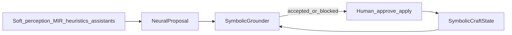

# Neuro-symbolic craft

Soft perceptual / heuristic proposals are always grounded by hard symbolic craft
rules before anything can apply. Humans still approve meaningful creative changes.



## Layers

| Layer | Role | Examples |
|-------|------|----------|
| Soft / “neuro” | Suggest only | MIR energy/beats, heuristic agents, narrow assistants, future `learned_model` |
| Hard / symbolic | Authorize, block, explain | Lifecycle gates, X-sheet exposures, `allow_auto_smooth=False`, domain fences, provenance |
| Human | Apply finals | Approve plan, accept suggestions, final shot approval |

There is **no aggregate AI quality score**. Grounded items stay `applied=False`
until a human accepts them through existing craft paths.

## Package

- `mvm/neurosymbolic/schemas.py` — `NeuralProposal`, `GroundingResult`, `NeuroSymbolicDecision`, `SymbolicCraftState`
- `mvm/neurosymbolic/symbolic.py` — build / load symbolic craft state predicates
- `mvm/neurosymbolic/grounding.py` — `ground_proposal(state, proposal)`
- `mvm/neurosymbolic/bridge.py` — assistant + MIR adapters, `decide()`, persistence under `neurosymbolic_decisions/`

## Hard rules (examples)

- Block proposals that set `allow_auto_smooth=True` or `applied_as_final=True`
- Block pose / cross-domain fence violations
- Block sound proposals that force every cue to motion
- Require explicit intent before detailed-animation domains
- MIR may suggest cel mode / smear; style-pack + exposure policy remain authoritative

## CLI

```text
mvm neurosym inspect <slug> --shot <id>
mvm neurosym ground <slug> --shot <id> [--assistants]
```

`inspect` prints symbolic predicates. `ground` runs MIR (and optional assistant)
proposals through the grounder and writes decision JSON + provenance.

## Studio

Plan ledger events may include a `neurosymbolic` summary. Build feed shows a
compact **Neuro → Symbolic** line with accepted / blocked / needs-human counts.

## Plugging a future learned model

1. Emit `NeuralProposal` with `source=learned_model` (reserved enum).
2. Call `ground_proposal` / `decide` unchanged.
3. Do not auto-apply; keep `applied=False` and record provenance layers
   (`neuro` vs `symbolic`).

No training loop or LLM API is required for this craft weave.
